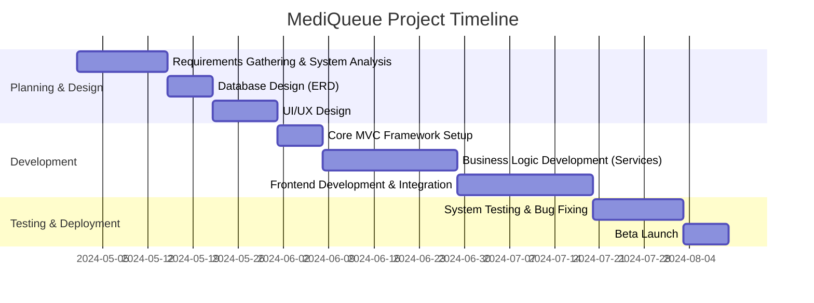

# MediQueue Project Documentation 🏥

This document contains all the organizational details for the **MediQueue** project as requested.

---

## 1. Project Name
**MediQueue** (Intelligent Medical Queue & Appointment Management System)

---

## 2. Project Idea
**MediQueue** is an integrated digital platform designed specifically for the healthcare sector. It aims to transform clinic management from traditional manual methods to a smart digital approach by providing tools for online appointment booking and real-time queue tracking. This reduces physical waiting time in clinics and enhances operational efficiency.

---

## 3. Problem Statement
The project addresses several challenges faced by patients and doctors:
*   **Waiting Room Overcrowding:** Leading to poor patient experience and increased risk of infection.
*   **Appointment Inaccuracy:** Traditional appointments are often delayed without the patient's knowledge, causing frustration.
*   **Burdensome Manual Management:** Reliance on paper records or simple spreadsheets leads to booking errors and scheduling conflicts.
*   **Accessibility Issues:** Patients often need to call or visit the clinic just to check available slots.

---

## 4. Project Goals
*   **Queue Organization:** Provide a live tracking system that allows patients to know their number in the queue and expected entry time from home.
*   **Enhanced Patient Experience:** Minimize actual in-clinic waiting time to the lowest possible levels.
*   **Increased Doctor Efficiency:** Provide a dashboard that enables doctors to manage their schedules and cases easily.
*   **Transparency:** Make information about clinics, specialties, and available appointments clear and accessible to everyone.

---

## 5. Project Plan / Timeline



---

## 6. Users / Actors
The system features 3 types of users:
1.  **Patient:** The person who searches for a clinic, makes a booking, and tracks their turn.
2.  **Doctor:** Responsible for providing the service and managing the patient queue for their clinic.
3.  **Admin:** Responsible for overall system management, adding clinics, and managing doctor and user accounts.

---

## 7. Functional Requirements

### Patient Features:
*   Account creation and login.
*   Search for clinics by specialty or location.
*   Book available appointments.
*   Cancel or reschedule bookings.
*   View live queue status.

### Doctor Features:
*   Set available slots.
*   Manage the queue (Start check-up, end session, call next patient).
*   View history of past and upcoming appointments.

### Admin Features:
*   Manage user accounts (Activate/Deactivate).
*   Add and edit clinic data.
*   Assign doctors to clinics.
*   View general system statistics.

---

## 8. Non-Functional Requirements
*   **Security:** Protect user data and appointments using the Identity system and password encryption.
*   **Performance:** Fast response for search and live queue updates.
*   **Availability:** The system should be available 24/7 for bookings.
*   **Usability:** Simple and organized interfaces suitable for all age groups.

---

## 9. Use Case Diagram

```mermaid
usecaseDiagram
    actor "Patient" as P
    actor "Doctor" as D
    actor "Admin" as A

    package "MediQueue System" {
        usecase "Search Clinics" as UC1
        usecase "Book Appointment" as UC2
        usecase "Track Queue Status" as UC3
        usecase "Manage Availability" as UC4
        usecase "Call Next Patient" as UC5
        usecase "Manage Clinics & Doctors" as UC6
        usecase "Login / Register" as UC7
    }

    P --> UC7
    P --> UC1
    P --> UC2
    P --> UC3

    D --> UC7
    D --> UC4
    D --> UC5

    A --> UC7
    A --> UC6
```

---

*Note: This content is designed to be copied directly into a **Word** document.*
