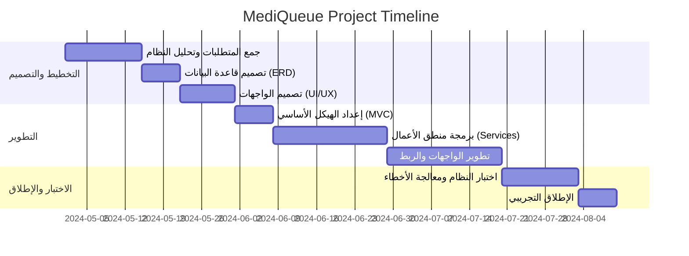

# توثيق مشروع MediQueue 🏥

هذا المستند يحتوي على كافة التفاصيل التنظيمية لمشروع **MediQueue** بناءً على المتطلبات المحددة.

---

## 1. اسم المشروع (Project Name)
**MediQueue** (نظام إدارة الطوابير والمواعيد الطبية الذكي)

---

## 2. فكرة المشروع (Project Idea)
مشروع **MediQueue** هو منصة رقمية متكاملة مصممة خصيصاً للقطاع الطبي. تهدف المنصة إلى تحويل عملية إدارة العيادات من الأسلوب اليدوي التقليدي إلى أسلوب رقمي ذكي، من خلال توفير أدوات لحجز المواعيد عبر الإنترنت، ومتابعة طوابير الانتظار بشكل مباشر (Real-time Queue Tracking)، مما يقلل من وقت الانتظار الفعلي داخل العيادة ويزيد من كفاءة العمل.

---

## 3. المشكلة التي يحلها المشروع (Problem Statement)
يعالج المشروع عدة تحديات تواجه المرضى والأطباء:
*   **الازدحام في غرف الانتظار:** الذي يؤدي إلى تجربة سيئة للمرضى وزيادة فرص انتقال العدوى.
*   **عدم دقة المواعيد:** المواعيد التقليدية غالباً ما تتعرض للتأخير دون علم المريض، مما يسبب إحباطاً.
*   **الإدارة اليدوية المرهقة:** اعتماد العيادات على السجلات الورقية أو الجداول البسيطة يؤدي إلى أخطاء في الحجز وتداخل المواعيد.
*   **صعوبة الوصول:** يحتاج المريض للاتصال أو الذهاب للعيادة فقط لمعرفة المواعيد المتاحة.

---

## 4. أهداف المشروع (Project Goals)
*   **تنظيم الطوابير:** توفير نظام تتبع حي يسمح للمريض بمعرفة رقمه في الطابور والوقت المتوقع لدخوله وهو في منزله.
*   **تحسين تجربة المريض:** تقليل وقت الانتظار الفعلي داخل العيادة لأدنى مستوياته.
*   **رفع كفاءة الطبيب:** توفير لوحة تحكم تمكن الطبيب من إدارة مواعيده وحالاته بسهولة.
*   **الشفافية:** إتاحة المعلومات حول العيادات، التخصصات، والمواعيد المتاحة بشكل واضح للجميع.

---

## 5. خطة المشروع (Project Plan / Timeline)



---

## 6. المستخدمون / الأدوار (Users / Actors)
يحتوي النظام على 3 أنواع من المستخدمين:
1.  **المريض (Patient):** الشخص الذي يبحث عن عيادة ويقوم بالحجز ومتابعة دوره.
2.  **الطبيب (Doctor):** المسؤول عن تقديم الخدمة وإدارة طابور المرضى الخاص بعيادته.
3.  **المدير (Admin):** المسؤول عن إدارة النظام بالكامل، إضافة العيادات، وإدارة حسابات الأطباء والمستخدمين.

---

## 7. المتطلبات الوظيفية (Functional Requirements)

### ميزات المريض:
*   إنشاء حساب وتسجيل الدخول.
*   البحث عن العيادات حسب التخصص أو الموقع.
*   حجز موعد متاح.
*   إلغاء أو تعديل الحجز.
*   رؤية حالة الطابور الحالية (Live Queue Status).

### ميزات الطبيب:
*   تحديد أوقات التوفر (Available Slots).
*   إدارة طابور الانتظار (بدء الكشف، إنهاء الحالة، استدعاء المريض التالي).
*   رؤية سجل المواعيد السابقة والقادمة.

### ميزات المدير:
*   إدارة حسابات المستخدمين (تفعيل/تعطيل).
*   إضافة وتعديل بيانات العيادات.
*   تعيين الأطباء للعيادات.
*   رؤية إحصائيات عامة حول النظام.

---

## 8. المتطلبات غير الوظيفية (Non-Functional Requirements)
*   **الأمان (Security):** حماية بيانات المستخدمين والمواعيد باستخدام نظام Identity وتشفير كلمات المرور.
*   **الأداء (Performance):** استجابة سريعة للبحث والتحديثات الحية للطابور.
*   **التوفر (Availability):** أن يكون النظام متاحاً على مدار الساعة للحجوزات.
*   **سهولة الاستخدام (Usability):** واجهات بسيطة ومنظمة تناسب جميع الفئات العمرية.

---

## 9. مخطط حالات الاستخدام (Use Case Diagram)

```mermaid
usecaseDiagram
    actor "Patient" as P
    actor "Doctor" as D
    actor "Admin" as A

    package "MediQueue System" {
        usecase "Search Clinics" as UC1
        usecase "Book Appointment" as UC2
        usecase "Track Queue Status" as UC3
        usecase "Manage Availability" as UC4
        usecase "Call Next Patient" as UC5
        usecase "Manage Clinics & Doctors" as UC6
        usecase "Login / Register" as UC7
    }

    P --> UC7
    P --> UC1
    P --> UC2
    P --> UC3

    D --> UC7
    D --> UC4
    D --> UC5

    A --> UC7
    A --> UC6
```

---

تنويه: هذا المحتوى مصمم ليتم نسخه مباشرة إلى ملف **Word**، مع إمكانية استخدام أدوات تحويل Mermaid إلى صور لإضافتها للمستند بشكل احترافي.
